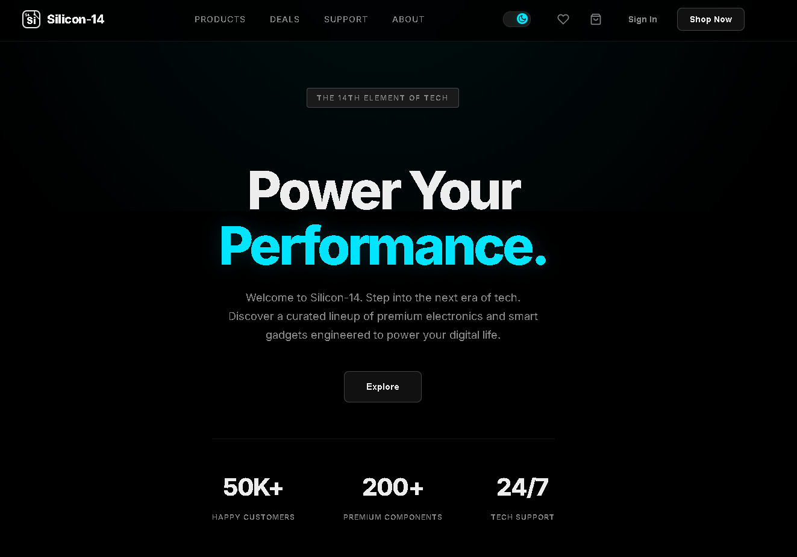

# Silicon-14: Premium Tech E-Commerce Platform

![Silicon-14 Mockup]


Silicon-14 is a modern, fully-responsive e-commerce web application built with React.js. It features a sleek, premium user interface designed for tech enthusiasts to browse, filter, and purchase top-tier electronics.

## ✨ Features

- **Dynamic Data Fetching**: Simulates a real-world backend by fetching product data asynchronously via a mock API (`fetch` and `useEffect`).
- **Advanced State Management**: Efficiently handles complex states like Shopping Cart, Wishlist, Product Filtering, and Sorting using React hooks.
- **Persistent Storage**: Utilizes `localStorage` to ensure user Cart and Wishlist data is saved across browser sessions.
- **Filtering & Sorting Engine**: Users can instantly search by product name, filter by specific brands (Apple, Samsung, Sony, etc.), and sort by price, rating, or name.
- **Premium UI/UX**: Features a highly aesthetic, responsive design with dark mode, interactive hover states, scroll-spy navigation, and smooth micro-animations.
- **Loading & Error States**: Professional handling of API lifecycles with custom loading spinners and fallback UI.

## 🛠️ Tech Stack

- **Frontend Framework**: React 19 (via Vite)
- **Styling**: Vanilla CSS3 with Custom Properties (CSS Variables) for theming
- **Data Fetching**: Native Fetch API
- **State Management**: React `useState`, `useEffect`
- **Deployment**: Vercel

## 🚀 Getting Started

Follow these steps to run the project locally on your machine.

### Prerequisites
Make sure you have [Node.js](https://nodejs.org/) installed on your machine.

### Installation

1. **Clone the repository** (if downloaded from GitHub):
   ```bash
   git clone https://github.com/your-username/silicon-14.git
   cd silicon-14
   ```

2. **Install dependencies**:
   ```bash
   npm install
   ```

3. **Start the development server**:
   ```bash
   npm run dev
   ```

4. **Open your browser** and navigate to the local host address provided in your terminal (usually `http://localhost:5173`).

## 📁 Project Structure

```text
├── public/
│   ├── products.json        # Mock API data
├── src/
│   ├── components/          # Reusable UI components (Hero, Navigation, etc.)
│   ├── index.css            # Global CSS variables and resets
│   ├── App.css              # Main application styles
│   ├── App.jsx              # Main container and state hub
│   └── main.jsx             # React entry point
└── package.json
```

## 👨‍💻 Developed By

Bhargav K

*Aspiring  Developer* 
